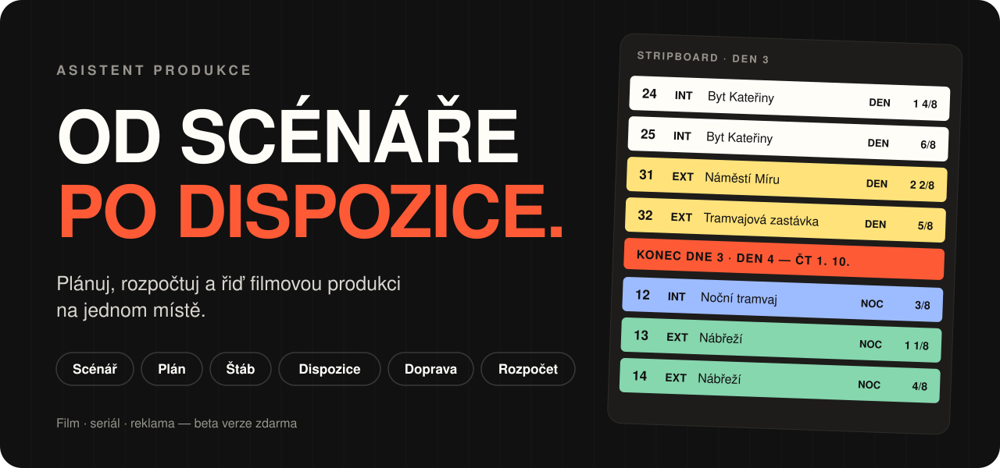
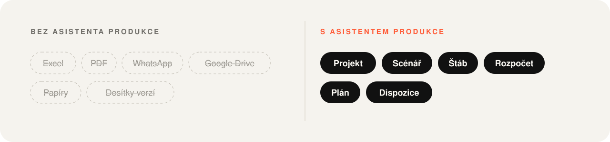
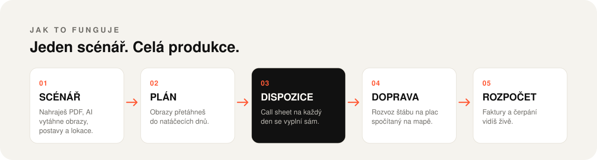
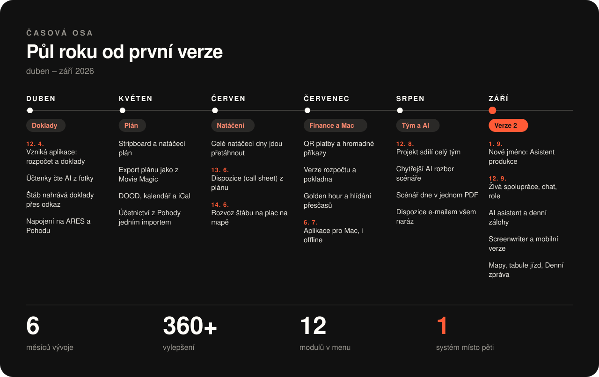

  

<h3 align="center">Asistent produkce pro Mac</h3>

  Scénář, plán, štáb, dispozice, doprava i rozpočet v jednom systému. 
  Stáhni si aplikaci, přihlas se stejným účtem jako na webu a pracuj i bez prohlížeče.

 

## ⬇️ Stáhnout

  
  &nbsp;
  

  
  <b>Který Mac mám?</b> Menu  → O tomto Macu: „Čip Apple M…“ = <b>Apple Silicon</b>, „Procesor Intel“ = <b>Intel</b>. 
  Starší verze najdeš v <a href="https://github.com/Josvach/asistent-produkce-release/releases">seznamu vydání</a>.
  

### Instalace ve třech krocích

| | |
|:---:|---|
| **1** | Otevři stažený `.dmg` a přetáhni **Asistent Produkce** do složky **Aplikace**. |
| **2** | Při prvním spuštění klikni na aplikaci **pravým tlačítkem → Otevřít → Otevřít**. Aplikace není z App Storu, macOS se proto jednou zeptá. Když to nejde: *Nastavení systému → Soukromí a zabezpečení → Přesto otevřít*. |
| **3** | Přihlas se stejným účtem jako na webu. |

> 🔄 **Další verze se instalují samy.** Aplikace si novou verzi stáhne a nabídne restart.

 

  

 

  

 

## ✨ Co umí

<table>
<tr>
<td width="50%" valign="top">

### 🎬 Scénář za pár minut rozebraný
Nahraješ PDF a AI z něj vytáhne obrazy, denní dobu, lokace, postavy, kostýmy
i rekvizity. Ve scénáři pak jedním klikem skočíš na kterýkoliv obraz.

</td>
<td width="50%" valign="top">

### 🗂️ Stripboard, jaký znáš
Obrazy i celé natáčecí dny přetahuješ myší, data dnů se dopočítají sama.
Z plánu hned vzniknou kalendář, DOOD, hercodny a export jako z Movie Magic.

</td>
</tr>
<tr>
<td valign="top">

### 📋 Dispozice samy od sebe
Call sheet na každý den se vyplní z plánu a ze Štábu: časy, obrazy, nástupy,
počasí, golden hour, nejbližší nemocnice i mapa basu a parkování.
Celému štábu je pošleš jedním e-mailem, i se scénářem dne.

</td>
<td valign="top">

### 🚐 Rozvoz štábu na plac
Aplikace spočítá, kdo s kým pojede a kdy vyjet, aby všichni stihli nástup
a zbytečně nečekali. Jízdy upravíš přetažením a řidičům pošleš hotové texty.

</td>
</tr>
<tr>
<td valign="top">

### 💰 Rozpočet pod kontrolou
Faktury a účtenky se přiřadí ke kategoriím rozpočtu a čerpání vidíš živě.
Účtenku stačí vyfotit a AI ji přečte. Štáb posílá doklady přes odkaz
a všechno jde do Pohody.

</td>
<td valign="top">

### 👥 Celý tým v jednom projektu
Změny ostatních vidíš okamžitě. Každý má svoji roli a práva, projekt má
vlastní chat a AI asistent odpoví na otázky nad daty projektu.

</td>
</tr>
<tr>
<td valign="top">

### 📱 Na place i v kanceláři
Na počítači, na mobilu (přehled dne na place, sken účtenky, chat)
i jako aplikace pro Mac, která funguje offline.

</td>
<td valign="top">

### 🛟 Nic se neztratí
Projekt se každou noc sám zálohuje včetně příloh. Kterýkoliv den
porovnáš s dneškem a vrátíš jen to, co potřebuješ.

</td>
</tr>
</table>

 

## 🎯 Pro koho to je

| | |
|---|---|
| **Produkční** | Rozpočet, faktury, paragony a cost report bez tří tabulek. |
| **Vedoucí výroby** | Plán, natáčecí dny a dispozice, které sedí se scénářem. |
| **Asistent režie** | Rozpis scénáře a stripboard, který se přepočítá sám. |
| **Producent** | Jedno číslo, kterému se dá věřit, a to kdykoliv, ne až po natáčení. |

 

## 🗓️ Jak to vznikalo

  

<b>Milníky podrobněji</b>

 

| Kdy | Co se stalo |
|---|---|
| **12. 4. 2026** | 🚀 Vzniká první verze: rozpočet, faktury a účtenky. Ještě ten den AI skener účtenek a odkaz, přes který štáb nahrává doklady. |
| **13. 4.** | Napojení na účetnictví Pohoda a Inbox, který hlídá duplicity. |
| **19. 4.** | První rozbor scénáře a natáčecí plán. |
| **Květen** | 🗂️ Stripboard, export plánu jako z Movie Magic, DOOD, kalendář s iCalem pro telefony. |
| **13. 6.** | 📋 Dispozice (call sheet) generované z plánu. |
| **14. 6.** | 🚐 Plánovač rozvozu štábu na mapě. |
| **3. 7.** | 💳 QR platby, hromadné příkazy k úhradě, verze rozpočtu, pokladna, golden hour, hlídání přesčasů. |
| **6. 7.** | 💻 Aplikace pro Mac, která funguje i bez internetu. |
| **12. 8.** | 👥 Projekt může sdílet celý tým. |
| **13.–14. 8.** | Chytřejší AI rozbor scénáře, scénář dne v jednom PDF, dispozice e-mailem, počasí a nemocnice automaticky. |
| **1. 9.** | ✨ Nové jméno **Asistent produkce**, nový web a nový vzhled. |
| **12.–13. 9.** | ⚡ Verze 2.5–2.7: živá spolupráce, role a práva, chat a AI asistent. |
| **18. 9.** | 🛟 Automatické denní zálohy. |
| **21.–22. 9.** | ✍️ Screenwriter, editor pro psaní scénáře, i ve dvou najednou. |
| **24. 9.** | 🌙 Tmavý režim. |
| **25.–26. 9.** | 🗺️ Verze 2.10: nový Štáb, mapy basu a parkování, tabule jízd, mobilní přehled dne na place. |
| **27. 9.** | 📝 Denní zpráva z natáčení s exportem do PDF a Excelu. |

 

  

  <b>Beta verze zdarma</b> · <a href="https://asistentprodukce.cz/">asistentprodukce.cz</a>

 

---

Tohle repo obsahuje jen hotové instalační balíčky a soubory pro automatické aktualizace. Zdrojový kód tu není.

  

Autorem a vlastníkem projektu je Josef Vácha. Všechna práva vyhrazena.
Kontakt: <a href="https://asistentprodukce.cz/">asistentprodukce.cz</a>.
© Josef Vácha 2026

